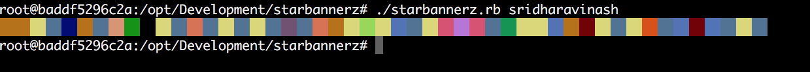

# starbannerz
A console color banner of your starred repo languages
Uses the GitHub `languages.yml` color scheme and outputs a progress bar like colorized banner in your console.
Only shows the colors for the last 100 starred repos in ascending order.



# Install
```
bundle
```
Add github api credentials access to a `config.yml` file

# Usage
```
./starbannerz.rb <username>
```


